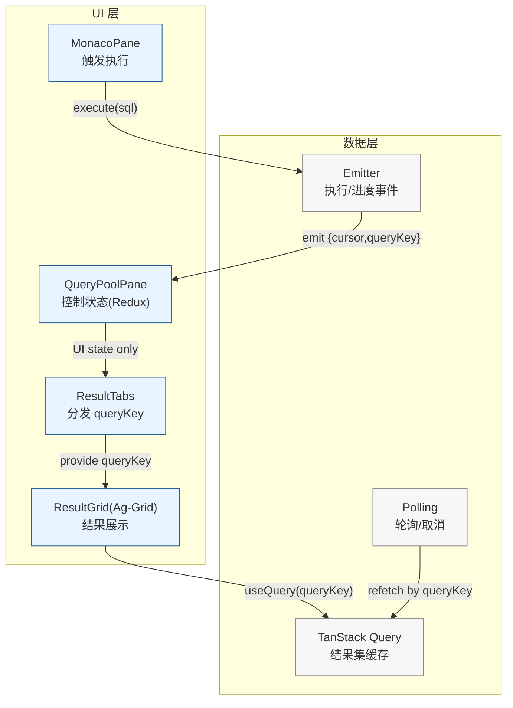
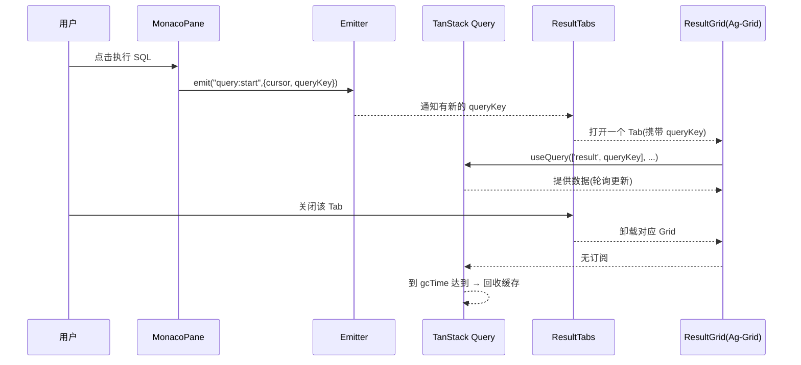

[[toc]]


> 场景：执行 SQL → 轮询结果 → 多 Tab 分发 → Ag-Grid 展示（大体量、长链路、长期使用）

## TL;DR

- **把大数据从 Redux 挪走**：Redux 只存 UI/控制状态；**结果集交给 TanStack Query**（staleTime + gcTime，按订阅回收）。

- **明确数据所有权**：ResultTabs 只路由 **queryKey**；每个表格组件用 `useQuery` 自己订阅/释放自己的数据。

- **轮询归数据层**：在 Query 层（或 Emitter→Query）实现轮询与取消；组件卸载即停止。

- **修复两类高发泄漏**：单例组件的长期订阅；`useEffect/useCallback` 对大对象的闭包依赖。

- **验证闭环**：Profiler 锁定重渲染热点 + Heap Snapshot 对比确认对象回收。

---

## 1. 症状与根因

### 1.1 典型症状

- 连续执行 SQL 或切换/关闭 Tab 后，**内存不降**或缓慢上升。

- 多次执行后出现 **频繁 GC**、表格滚动卡顿、甚至崩溃。

### 1.2 根因归类

1. **Redux 长期持有大对象**（rows/columns/中间结果），与组件生命周期脱钩。
2. **单例（QueryPool、ResultTabs）**订阅数据流但**不释放**，关闭 Tab 后仍保留引用链。
3. **闭包依赖不当**：`useEffect/useCallback` 把上一次的大数组/列定义“带进来”，导致对象无法被释放。
4. 轮询/事件在 UI 层实现，**组件卸载不一定停**，残留定时器/订阅。

---

## 2. 设计原则

- **分层**：UI（控制状态）与数据（结果集）解耦；UI 只持“键”，不持“数据”。
- **按订阅回收**：无组件订阅即触发缓存回收（TanStack Query 的 `gcTime`）。
- **幂等与可取消**：每个执行可取消/超时；轮询能按键停。
- **单向数据流**：执行/轮询 → 结果键 → 订阅 → 展示/释放，任何方向都能定位所有权。

---

## 3. 目标架构（Mermaid）

### 3.1 组件与数据所有权



### 3.2 执行与回收时序



---

## 4. 改造步骤与关键代码

### 4.1 数据不入 Redux：只存 UI/控制

```ts
// Redux slice: 只管理 UI 控制，不存 rows/cols 等大对象
const resultUiSlice = createSlice({
  name: 'resultUi',
  initialState: { activeTab: 0, keys: [] as string[], loading: false, error: null as string | null },
  reducers: {
    addKey(s, a: PayloadAction<string>) { s.keys.push(a.payload) },
    removeKey(s, a: PayloadAction<string>) { s.keys = s.keys.filter(k => k !== a.payload) },
    setActiveTab(s, a: PayloadAction<number>) { s.activeTab = a.payload },
    setLoading(s, a: PayloadAction<boolean>) { s.loading = a.payload },
    setError(s, a: PayloadAction<string | null>) { s.error = a.payload },
  }
})
```

### 4.2 执行与发放 queryKey（Emitter）

```ts
// 执行 SQL：服务端返回 { cursor, queryKey }，不要把数据塞进 Redux
async function runQuery(sql: string) {
  const { cursor, queryKey } = await api.execute(sql)
  emitter.emit('query:start', { cursor, queryKey })
  return { cursor, queryKey }
}

// 监听执行开始：把 queryKey 交给 UI 层（ResultTabs）
useEffect(() => {
  const off = emitter.on('query:start', ({ queryKey }) => {
    dispatch(addKey(queryKey))
  })
  return () => off()
}, [dispatch])
```

### 4.3 Query 层：轮询 + 回收

> 以 TanStack Query v5 术语为例：`staleTime` 控制新鲜度，`gcTime` 控制无订阅时的缓存保留时间

```ts
export function useResult(queryKey: string) {
  return useQuery({
    queryKey: ['result', queryKey],
    queryFn: () => api.fetchByCursor(queryKey),
    refetchInterval: 1000, // 轮询
    staleTime: 10_000, // 10s 内视为新鲜
    gcTime: 60_000, // 无订阅保留 60s，之后自动回收
    enabled: Boolean(queryKey),
  })
}
```

可在 QueryClient 层设置缺省策略，避免散落配置：

```ts
const queryClient = new QueryClient({
  defaultOptions: {
    queries: {
      staleTime: 10_000,
      gcTime: 60_000,
      refetchOnWindowFocus: false,
    }
  }
})
```

### 4.4 分发层 ResultTabs：只路由键，不触碰数据

```tsx
function ResultTabs() {
  const keys = useSelector((s: RootState) => s.resultUi.keys)
  const [active, setActive] = useState(0)
  const activeKey = keys[active]

  const close = (k: string) => {
    queryClient.removeQueries({ queryKey: ['result', k] }) // 立刻清理（可选）
    dispatch(removeKey(k))
    setActive(a => Math.max(0, Math.min(a, keys.length - 2)))
  }

  return (
    <Tabs value={active} onChange={setActive}>
      {keys.map((k, i) => (
        <TabPanel key={k} value={i} onClose={() => close(k)}>
          <ResultGrid queryKey={k} />
        </TabPanel>
      ))}
    </Tabs>
  )
}
```

### 4.5 展示层 ResultGrid（Ag-Grid 直连数据）

```tsx
function ResultGrid({ queryKey }: { queryKey: string }) {
  const { data, isFetching, error } = useResult(queryKey)
  const rows = data?.rows ?? []
  const cols = data?.cols ?? []

  // 卸载时释放 Grid 资源
  useEffect(() => () => gridApi?.destroy?.(), [])

  if (error)
    return <div>加载失败</div>
  return (
    <AgGridReact
      rowData={rows}
      columnDefs={cols}
      overlayLoadingTemplate={isFetching ? '<span>加载中...</span>' : undefined}
      suppressAnimationFrame={false} // 允许内部虚拟滚动优化
    />
  )
}
```

---

## 5. 修复两类高发泄漏

### 5.1 单例组件的订阅与清理

- 单例（QueryPool、ResultTabs）**不要直接订阅大数据**；只订阅键/控制状态。

### 5.2 `useEffect/useCallback` 闭包大对象

- 避免把 rows/cols 之类的大对象放进依赖；**使用 key/id 或 ref** 读取。

- 对需要稳定引用的函数，优先“稳定回调”（如 `useRef`）而非过度 `useCallback`。

```ts
const rowsRef = useRef<any[]>([])
useEffect(() => { rowsRef.current = rows }, [rows]) // 读 ref，避免闭包长持旧大对象
```

---

## 6. 验证与回归

### 6.1 Profiler

- 路径：执行一次→结果出现→来回切 Tab→关闭 Tab。

- 关注：ResultTabs/ResultGrid 是否只在必要时渲染； 无关组件不需要重新渲染。

### 6.2 Heap Snapshot

- 初始 → 多次执行/关闭后 → 60s（gcTime）后。

- 对比 `Detached HTMLDivElement`、长链 Map/Set是否下降。

- 关闭某个 `queryKey` 后，确认对应对象在下一轮 GC 不再存活。

---

## 7. 常见误解与修正

- **"Redux 清空即回收"**：不一定。还有引用链（闭包、单例订阅、全局 Map）要一起断开。

---


